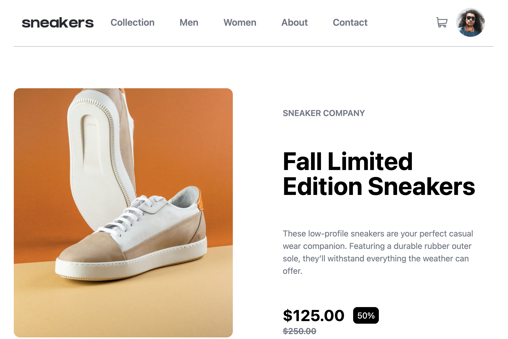

# Frontend Mentor - E-commerce product page solution

This is a solution to the [E-commerce product page challenge on Frontend Mentor](https://www.frontendmentor.io/challenges/ecommerce-product-page-UPsZ9MJp6). Frontend Mentor challenges help you improve your coding skills by building realistic projects.

## Table of contents

- [Overview](#overview)
  - [The challenge](#the-challenge)
  - [Screenshot](#screenshot)
  - [Links](#links)
- [My process](#my-process)
  - [Built with](#built-with)
  - [What I learned](#what-i-learned)
- [Author](#author)

## Overview

### The challenge

Users should be able to:

- View the optimal layout for the site depending on their device's screen size
- See hover states for all interactive elements on the page
- Open a lightbox gallery by clicking on the large product image
- Switch the large product image by clicking on the small thumbnail images
- Add items to the cart
- View the cart and remove items from it

### Screenshot

### Links

- Solution URL: [GitHub](https://github.com/piyush-kaushik24/e-commerce-product-page)
- Live Site URL: [E-commerce product page ](https://e-commerce-product-page-ashy-seven.vercel.app/)

## My process

### Built with

- Semantic HTML5 markup
- CSS custom properties
- Flexbox
- CSS Grid
- Mobile-first workflow
- [TypeScript](https://www.typescriptlang.org/)
- [React](https://react.dev/) - JS library
- [Tailwind CSS](https://tailwindcss.com/) - CSS framework

### What I

- Practiced breaking a larger UI into reusable React components.
- Used useState to manage product quantity, cart state, mobile navigation, image selection, and the image lightbox.
- Built a data-driven image gallery using .map() instead of repeating similar JSX.
- Implemented desktop and mobile image galleries with next/previous navigation and thumbnail selection.
- Built a responsive lightbox image viewer for the desktop layout.
- Used useEffect and useRef to handle click-outside behavior for menus and the cart.
- Improved my understanding of managing multiple independent pieces of UI state in a React application.

## Author

- GitHub - [@piyush-kaushik24](https://github.com/piyush-kaushik24)
- Frontend Mentor - [@piyush-kaushik24](https://www.frontendmentor.io/profile/piyush-kaushik24)
